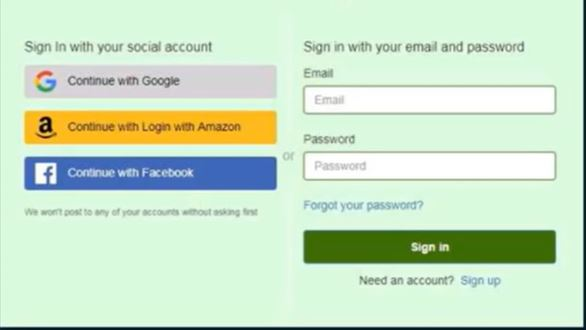
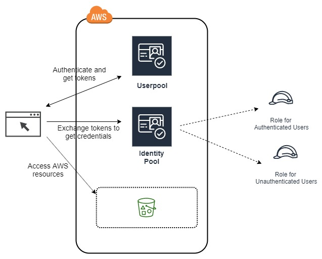
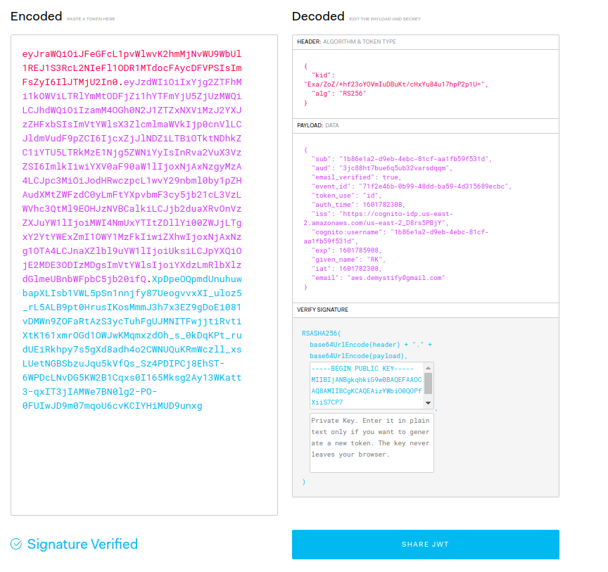
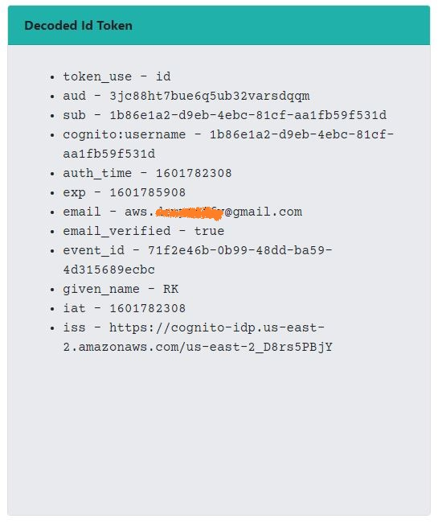
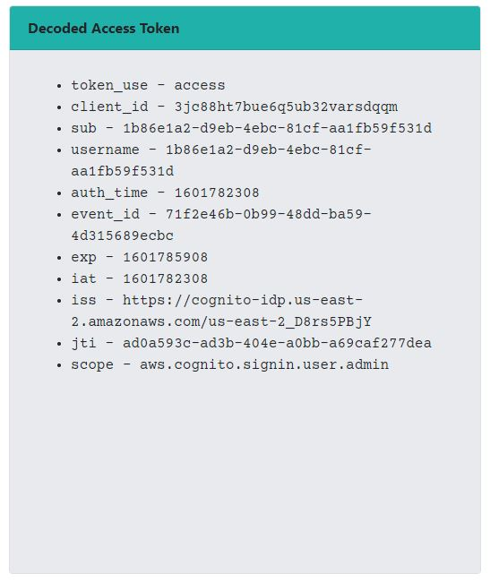
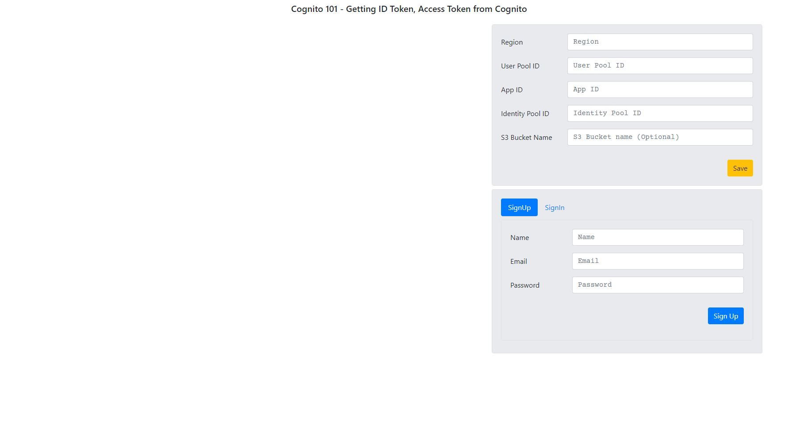
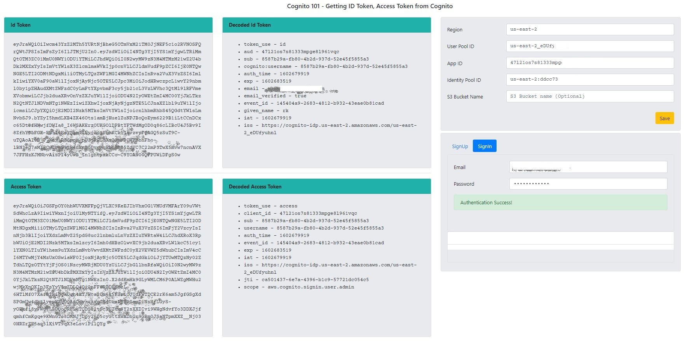
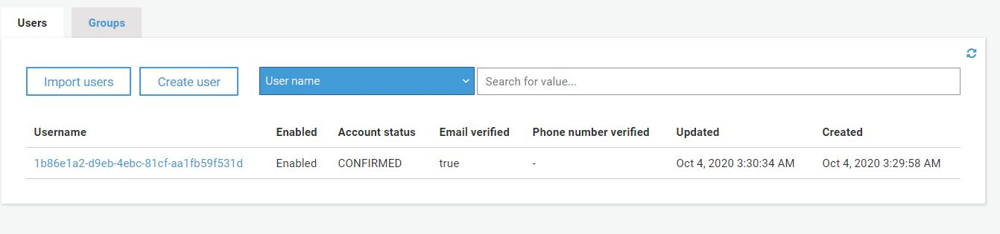
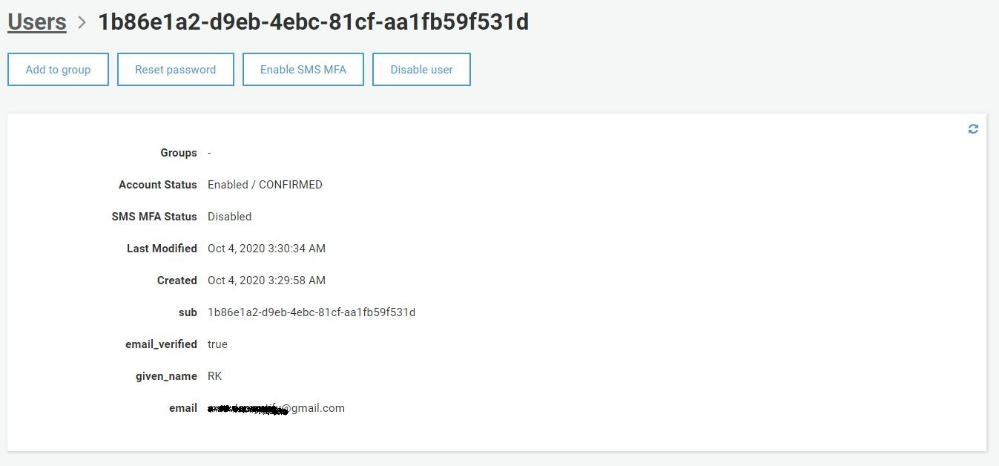

# AWS Cognito User Pool Tokens

Id: 19-cognito-userpools
Author: ryandam
Summary: AWS Cognito Userpools
Categories: AWS, Cognito, ID Token, Access Token, Refresh tokens, Authentication, Authorization
Status: Draft
Feedback Link: ryandam.9@gmail.com

## Overview

This post provides a very high-level overview of AWS Cognito User pool tokens. It does not go in-depth, but maybe useful for someone who is just beginning to use Cognito.

## Why Cognito?

Let’s say we are developing a web/mobile application with AWS as backend (Databases, Instances, API Gateway, Lambda functions all deployed on AWS). When someone wants to access our application, we would like to provide two options:

- **As a guest user**
  
  - The user does not need to register himself.  However, he cannot access all the services offered by the application.
- **As a Registered user**, 
  
  - The user can sign up using Email/Phone number/user name and password
  
  - He can also signup using his Facebook/Google/Apple/Amazon accounts. 
  
    

When it comes to user management, as the app developer, we need to support several different use cases.

**Authentication**

- Securely store user-related information (User ID/Email/Phone number/password). 
- Password reset
- Deregister the user
- How to verify the user ID/password entered is correct?
- Multifactor Authentication

**Authorization**

- After successful login, what type of services the user can access?

*AWS Cognito helps solve these problems using* **User Pools** *and* **Identity Pools.**



## Questions?

Assuming you’re beginning to use AWS Cognito, I guess you’ll have the following questions.

- What is the difference between *User Pools* and *Identity pools*?
- What are *ID Token, Access Token, JWT Token*? What’s the use of each of these?

I cannot provide a straight answer, but the following discussion might help.

## User Pools

As the name says a User Pool is nothing but a *Pool of Users*. Cognito supports different user management-related use cases. In addition to allowing users to sign up/sign in using User ID/Email/password, it supports **Federated Identities,** where a user can sign up/sign in using his Gmail/Facebook account. These are called **Social Identity Providers.**

## What happens after a user is authenticated ?

After a user is successfully authenticated, we can request Cognito to provide an *ID token* and *Access Token.* These are called **User Pool Tokens.**

## How do the tokens look like ?

- The ID token and Access token are both JSON objects. But, the objects are encoded using base64 format.
- The ID token should comply with JWT (JSON Web Token) format.
- The Access token also conforms to [JWT format](https://tools.ietf.org/html/rfc7519).

An encoded ID looks like this:

```sh
eyJraWQiOiJFeGFcL1pvWlwvK2hmMjNvWU9WbUl1REJ1S3RcL2NIeFl1ODR1MTdocFAycDFVPSIsImFsZyI6IlJTMjU2In0.eyJzdWIiOiIxYjg2ZTFhMi1kOWViLTRlYmMtODFjZi1hYTFmYjU5ZjUzMWQiLCJhdWQiOiIzamM4OGh0N2J1ZTZxNXViMzJ2YXJzZHFxbSIsImVtYWlsX3ZlcmlmaWVkIjp0cnVlLCJldmVudF9pZCI6IjcxZjJlNDZiLTBiOTktNDhkZC1iYTU5LTRkMzE1Njg5ZWNiYyIsInRva2VuX3VzZSI6ImlkIiwiYXV0aF90aW1lIjoxNjAxNzgyMzA4LCJpc3MiOiJodHRwczpcL1wvY29nbml0by1pZHAudXMtZWFzdC0yLmFtYXpvbmF3cy5jb21cL3VzLWVhc3QtMl9EOHJzNVBCalkiLCJjb2duaXRvOnVzZXJuYW1lIjoiMWI4NmUxYTItZDllYi00ZWJjLTgxY2YtYWExZmI1OWY1MzFkIiwiZXhwIjoxNjAxNzg1OTA4LCJnaXZlbl9uYW1lIjoiUksiLCJpYXQiOjE2MDE3ODIzMDgsImVtYWlsIjoiYXdzLmRlbXlzdGlmeUBnbWFpbC5jb20ifQ.XpDpeOQpmdUnuhuwbapXLIsb1VWL5pSn1nnjfy87UeogvvxXI_uloz5_rL5ALB9pt0HrusIKosMmmJ3h7x3EZ9gDoEi081vDMWn9ZOFaRtAzS3ycTuhFgUJMNITFwjjtiRvtiXtK161xmrOGd1OWJwKMqmxzdOh_s_0kDqKPt_rudUEiRkhpy7s5gXd8adh4o2CWNUQuKRmWczll_xsLUetNGBSbzuJqu5kVfQs_Sz4PDIPCj8EhST-6WPDcLNvDG5KW2B1Cqxs0I165Mksg2Ay13WKatt3-qxIT3jIAMWe7BN0lg2-PO-0FUIwJD9m07mqoU6cvKCIYHiMUD9unxg
```

## How to Decode a ID Token or Access Token

[https://jwt.io/](https://jwt.io/) can be used to decode JWT Tokens.



Negative

: ID Token/Access Token can potentially give access to APIs and to resources. They should not be exposed to end users.

## What type of data is encoded in ID Token & Access Token ?

### ID Token

An ID Token holds the following details.

- `token_use` - *Token type*

- `aud` - *Audience* (this is the application ID registered with User Pools)

- `sub` - *Subject* (It is the *username* Cognito generated for the user)

- `email`, `given_name` are the  ***Claims*** associated with the user.

- `iss` - *Issuer* 

- `iat` , `exp` are *Issued time* and *Expiration time* respectively. The difference `160175908 - 1601782308 = 3600 sec`.

  



### Access Token

- The user pool access token contains ***claims about the authenticated user, a list of the user's groups, and a list of scopes.*** 
- The purpose of the access token is to authorise API operations in the context of the user in the user pool. For example, it can be used to  grant your user access to add, change, or delete user attributes.



## How can an application use the tokens to access AWS Services?

- An ID Token or Access token can be passed from web/mobile client as an ***Authorization\*** header to call an API Gateway API.
- To do this, an ***Authorizer\*** should be defined using the Cognito User Pool.

## Identity Pools

*Authentication using User Pools is fine. After a user logged in, what setup is required to grant access to him? What if he wants to upload an audio file for live Audio to text conversion? If he submits a form from the application and the form data needs to be processed and stored in a DynamoDB database?*

The solution to this problem is **Identity Pools.**

As per AWS, “*Amazon Cognito identity pools provide temporary AWS credentials for users who are guests (unauthenticated) and for users who have been authenticated and received a token. An identity pool is a store of user identity data specific to your account.*“

**Creating an Identity Pool**

- When creating an Identity pool, we need to supply two roles:

  - A role which will be used for all unauthenticated users
  - Another role is for all authenticated users.

  As you may know, we can attach one or more IAM policies to a Role. For example, to grant **Pub object** to an S3 bucket, we can create a policy and attach it to the role. so, when a user signs in, he will assume the role which eventually gives access to the s3 bucket. 

## A Simple browser application to fetch User Pool Tokens using JS SDK

I wrote a very simple Java Script browser application that takes a User Pool Configuration and fetches ID token/Access token from Cognito. If an S3 bucket name is given, it tries to list the objects in the bucket (To support this CORS access should be enabled on the bucket and the Role given to Authenticated users should have a policy giving access on the S3 bucket).





After the Email is verified, an entry for the user is created in AWS Cognito User pool.





### Source

- https://github.com/ryandam9/Cognito-tokens

****

